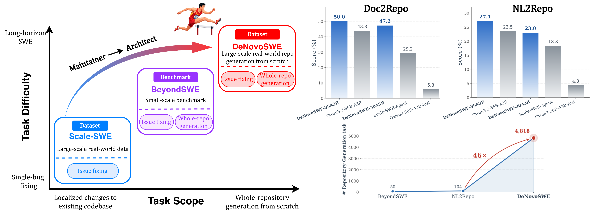
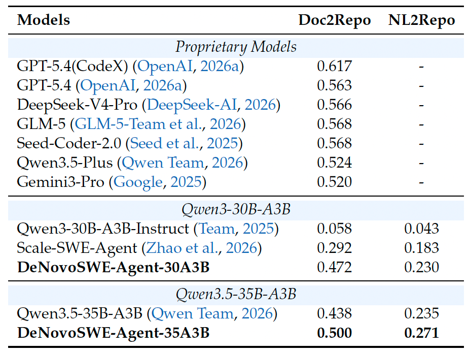

# DeNovoSWE: Scaling Long-Horizon Environments for Generating Entire Repositories from Scratch

<div align="center">

[](http://arxiv.org/abs/2606.10728)
[](https://huggingface.co/collections/AweAI-Team/denovoswe)
[](https://github.com/AweAI-Team/DeNovoSWE)
[](LICENSE)
<br>


</div>



## 🔥 Highlights
- 4,818 high-quality instances.
- 11k filtered trajectories from 34k DeepSeek-v4-High trajectories.
- Strong performance: 50% in BeyondSWE-Doc2Repo trained from Qwen3.5-35B-A3B.

## 📣 News
- **2026-06-10** 🚀 We released part of our data on [Hugging Face](https://huggingface.co/collections/AweAI-Team/denovoswe).  from DeepSeek-v4-High. 
- **2026-06-10** 📝 Our paper [**"DeNovoSWE: Scaling Long-Horizon Environments for Generating Entire Repositories from Scratch"**](http://arxiv.org/abs/2606.10728) is now available on arXiv.


## FAQ
- For evaluation of DeNovoSWE-Data, you can use AweAgent and refer to this [recipe](https://github.com/AweAI-Team/AweAgent/tree/main/recipes/denovo_swe).

## 📊 Data Format
| Field | Description |
|---|---|
| `instance_id` | Unique identifier for each benchmark instance. |
| `document` | Ground-truth documentation provided to the agent for repository reconstruction. |
| `pypi_name` | PyPI package name used to enforce anti-cheating constraints during evaluation. |
| `image_url` | URL of the Docker image configured for the environment. |
| `user` | GitHub username or organization owning the repository. |
| `repo` | Name of the target GitHub repository. |
| `workdir` | Working directory path of the repository inside the Docker container. |
| `unit_test` | List of all unit test identifiers. |
| `test_patch` | Code patch for unit tests, applied during the evaluation phase. |
| `test_binary_files` | Binary files used by unit tests that are unsuitable for standard text patching. |

## 🤖 Results



## DeNovoSWE-Agent
Key parameters can be seen below:

| Parameter | Value |
| :--- | :--- |
| Max turns | 500 |
| Max sequence length | 256k |
| Temperature | 1 |


## 📖 Citation

If you find this project useful for your research, please consider citing our paper:
```
@misc{zhao2026denovoswescalinglonghorizonenvironments,
      title={DeNovoSWE: Scaling Long-Horizon Environments for Generating Entire Repositories from Scratch}, 
      author={Jiale Zhao and Guoxin Chen and Fanzhe Meng and Wayne Xin Zhao and Ruihua Song and Ji-Rong Wen and Kai Jia},
      year={2026},
      eprint={2606.10728},
      archivePrefix={arXiv},
      primaryClass={cs.SE},
      url={https://arxiv.org/abs/2606.10728}, 
}
```

## 📄 License

This project is licensed under the CC BY 4.0 License - see the [LICENSE](LICENSE) file for details.

---

<div align="center">

**If you find this project useful, please consider giving it a ⭐ !**

</div>

## 🎗️ Supporters

This project is supported by [RUC AIBox](https://github.com/RUCAIBox).